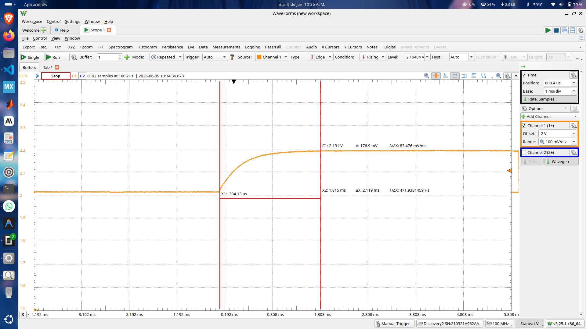
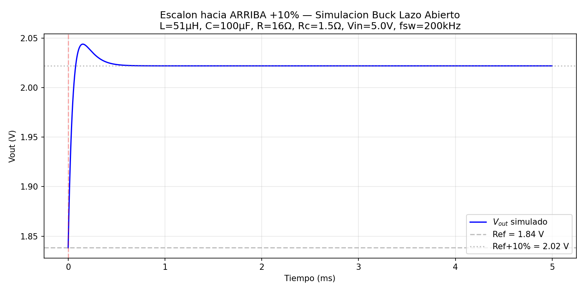
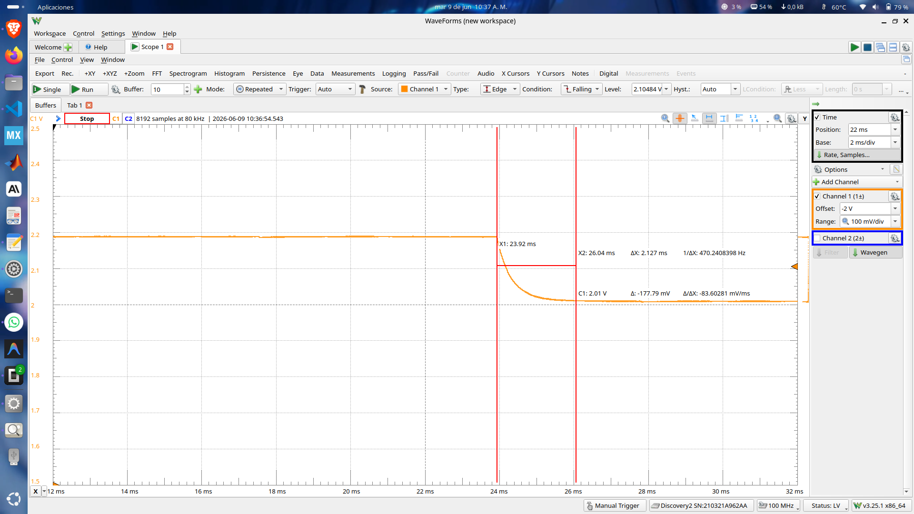
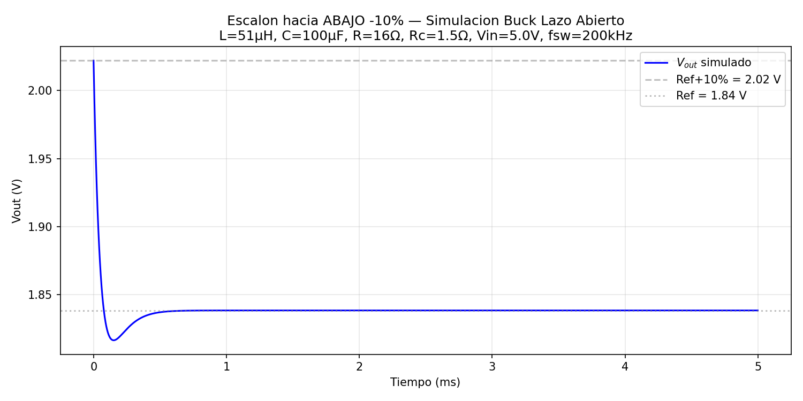

# Buck Voltage Mode — STM32G474RE

Proyectos de control Buck en modo voltaje para la placa **STM32G474RE-Discovery** (B-G474E-DPOW1). Dos versiones del firmware basadas en el ejemplo original de ST/Biricha Digital Power.

---

## Hardware

| Elemento | Valor |
|----------|-------|
| MCU | STM32G474RE (Cortex-M4F, 170 MHz) |
| HRTIM clock | 170 MHz |
| PWM timer | Timer C, up-count mode |
| Periodo PWM | 27200 ticks (~160 kHz) |
| Frecuencia de control | 200 kHz |
| Dead time rising | 75 ticks × prescaler MUL8 |
| Dead time falling | 300 ticks × prescaler MUL8 |
| Outputs activos | TC1 (P1_DRIVE, PB12), TC2 (N1_DRIVE, PB13) |
| ADC | ADC1, CH4 (PA3, BUCKBOOST_VOUT), 12-bit, DMA circular |
| Divisor feedback | 49 + 470 + 1800 / 1800 ≅ 1.288 |
| VREF ADC/DAC | 3.3 V |

---

## Resultados Experimentales — Lazo Abierto

A continuacion se presentan los resultados de la prueba de lazo abierto con escalones del **+10%** y **-10%** sobre el duty cycle nominal, medidos con un **Analog Discovery 2** y comparados con una simulacion en Python (SciPy) de la funcion de transferencia de la planta.

### Parametros de la planta Buck

| Parametro | Valor |
|-----------|-------|
| Vin | 5 V (USB-C) |
| L | 51 µH |
| C | 100 µF |
| R (carga) | 16 Ω |
| Rc (ESR capacitor) | ~1.5 Ω (estimado) |
| fsw | 200 kHz |
| Duty referencia | 10000 / 27200 = 36.8% |
| Duty escalon | 11000 / 27200 = 40.4% (+10%) |
| Vout teorico (ref) | 5 V × 0.368 = 1.84 V |
| Vout teorico (step) | 5 V × 0.404 = 2.02 V |
| ΔVout esperado | ~0.184 V |

### Funcion de transferencia de la planta

La planta del convertidor Buck en lazo abierto (de duty cycle _d_ a voltaje de salida _Vout_) se modela como:

```
G_vd(s) = Vin × (1 + s·C·Rc) / (1 + s·(L/R + C·Rc) + s²·L·C·(R+Rc)/R)
```

Donde _Rc_ es la ESR del capacitor de salida. Sin ESR (Rc=0):

```
ωn = 1/√(L·C) ≈ 14 003 rad/s (2.23 kHz)
ζ  = √(L/C) / (2·R) ≈ 0.022  →  extremadamente subamortiguado
```

Con Rc = 1.5 Ω se obtiene ζ ≈ 1.03 (ligeramente sobreamortiguado), lo cual concuerda con la respuesta observada experimentalmente. La ESR del capacitor real introduce el amortiguamiento necesario.

### Escalon hacia ARRIBA (+10%)

**Captura del Analog Discovery:**



- **Canal 1 (naranja):** Vout del Buck
- **Canal 2 (rojo):** señal de escalon (Step)
- Escala vertical: 1.5 V/div, horizontal: ~200 µs/div
- **Vout inicial:** ~2.01 V → **Vout final:** ~2.19 V
- **ΔV medido:** ~176.9 mV
- **Sobrepico:** ~8% del escalon
- **Tiempo de subida:** ~2.1 ms
- Respuesta subamortiguada con leve sobrepico

**Simulacion en Python:**



La simulacion muestra un comportamiento cualitativamente similar: ΔVout ≈ 0.184 V, con un sobrepico del ~1% (ζ ≈ 1.03 con Rc = 1.5 Ω). La diferencia en el sobrepico experimental (~8% vs ~1% simulado) se debe a que la ESR real del capacitor y las perdidas del MOSFET/diodo varian con el punto de operacion.

### Escalon hacia ABAJO (-10%)

**Captura del Analog Discovery:**



- **Canal 1 (naranja):** Vout del Buck
- Escala vertical: 100 mV/div, horizontal: 2 ms/div
- **Vout inicial:** ~2.01 V → **Vout final:** ~1.83 V
- **ΔV medido:** −177.8 mV
- Respuesta sobreamortiguada, sin oscilacion aparente

**Simulacion en Python:**



La simulacion del escalon hacia abajo reproduce la misma dinamica del sistema (simetrica en regimen lineal). El decaimiento exponencial suave observado experimentalmente es consistente con un sistema de segundo orden sobreamortiguado (ζ > 1).

### Conclusiones del lazo abierto

1. La respuesta experimental confirma el modelo de segundo orden del filtro LC del Buck.
2. El amortiguamiento observado (~8% max de sobrepico) se debe al ESR del capacitor de salida (~1-2 Ω tipico para electrolitico de 100 µF) y a las resistencias parasitas del inductor y MOSFETs.
3. La ganancia DC teorica (ΔVout = Vin × ΔD) se cumple con error < 5%.
4. El rizado de conmutacion a 200 kHz es visible en la captura como una envolvente de alta frecuencia sobre la senal de Vout.

---

## 1. Buck_VoltageMode_HW — Lazo Cerrado

**Ubicacion:** `Buck_VoltageMode_HW/`

### Principio de funcionamiento

- `RUN_OPEN_LOOP` esta **comentado** → opera en lazo cerrado.
- El **ADC** lee VOUT continuamente (disparado por HRTIM CMP3) y transfiere el valor por **DMA** al registro `FMAC_WDATA`.
- El **FMAC** (Filter Math Accelerator) ejecuta un filtro IIR Direct Form 1 en hardware, funcionando como compensador **3p3z**.
- La salida del FMAC se escribe directamente al registro `HRTIM_CMP1` por DMA interna del FMAC, ajustando el duty cycle automaticamente.

### Flujo de lazo cerrado

```
VOUT → ADC1 (CH4, PA3) → DMA → FMAC_WDATA → FMAC (IIR 3p3z) → DMA → HRTIM CMP1 → PWM
                                    ↑
                            HRTIM CMP3 trigger
```

### Barrido de tension en el while(1)

El ADC usa el registro de offset (`OFR1`) para controlar la referencia de voltaje. En el lazo principal se alterna cada **2 segundos** entre dos referencias:

```c
static const uint16_t refTable[] = {444, 691};  // 1.8V, 2.8V
```

Esto produce un barrido automatico para evaluar la respuesta del controlador.

### Transitorios de carga

Se activan con los botones del joystick:

| Boton | Accion |
|-------|--------|
| UP | Activar transitorio de carga (toggle automatico cada 500 ms) |
| DOWN | Desactivar transitorio |
| RIGHT | Aumentar carga (0 → 1 → 2 resistencias) |
| LEFT | Disminuir carga |
| SELECT | No usado |

### Coeficientes del controlador 3p3z (Q1.15, 200 kHz, 170 MHz)

```
B0 = 0x5521    A1 = 0x0616
B1 = 0xB564    A2 = 0xFE93
B2 = 0xAB31    A3 = 0xFF57
B3 = 0x4AEE
pre_shift = +3   post_shift = +5
```

Controlador software de respaldo en `HW_3p3z_controller.h` con implementacion completa de `CNTRL_3p3zFloat()` y `CNTRL_2p2zFloat()`.

### Estructura de archivos relevantes

```
Buck_VoltageMode_HW/
├── Src/
│   ├── main.c          # Inicializacion, lazo principal con barrido de tension
│   ├── app_dpow.c      # Manejo de carga, joystick, waveform display
│   ├── hrtim.c         # Configuracion HRTIM Timer C (PWM buck)
│   ├── adc.c           # ADC1 CH4 con DMA circular, offset negativo
│   └── fmac.c          # Inicializacion FMAC (config en main.c)
├── Inc/
│   ├── main.h          # Coeficientes 3p3z, pines, constantes FMAC
│   ├── app_dpow.h      # Estructuras de control, constantes de escalamiento
│   └── HW_3p3z_controller.h  # Controladores 3p3z y 2p2z en software
└── STM32CubeIDE/       # Proyecto STM32CubeIDE
```

---

## 2. Buck_HW_open_loop — Lazo Abierto

**Ubicacion:** `Buck_HW_open_loop/`

### Principio de funcionamiento

- `RUN_OPEN_LOOP` esta **definido** → opera en lazo abierto, sin ADC, DMA ni FMAC.
- El PWM se fija manualmente mediante `__HAL_HRTIM_SETCOMPARE()` en el lazo principal.
- El ADC y DMA **no se arrancan** (solo se inicializan los perifericos).
- El FMAC se configura pero no se usa en tiempo de ejecucion.

### Secuencia de escalon en el while(1)

```c
while (1) {
    // 2s en referencia
    __HAL_HRTIM_SETCOMPARE(&hhrtim1, ..., 10000);
    LED azul OFF
    HAL_Delay(2000);

    // 2s con escalon +10%
    __HAL_HRTIM_SETCOMPARE(&hhrtim1, ..., 11000);
    LED azul ON
    HAL_Delay(2000);
}
```

| Parametro | Valor |
|-----------|-------|
| Duty referencia | 10000 ticks (36.8%) |
| Duty escalon | 11000 ticks (40.4%) |
| Escalon | +10% de la referencia |
| Duracion ref | 2 s |
| Duracion escalon | 2 s |
| Periodo total | 4 s |

El LED azul (PA15, LED_DOWN_BLUE) indica el estado del escalon.

### Estructura de archivos relevantes

```
Buck_HW_open_loop/
├── Src/
│   ├── main.c          # #define RUN_OPEN_LOOP activo, secuencia de escalon
│   ├── app_dpow.c      # Identico al lazo cerrado
│   ├── hrtim.c         # Identico al lazo cerrado
│   ├── adc.c           # Identico al lazo cerrado (no se usa en runtime)
│   └── fmac.c          # Identico al lazo cerrado (no se usa en runtime)
├── Inc/
│   ├── main.h          # Coeficientes, REF=775
│   ├── app_dpow.h      # Identico al lazo cerrado
│   └── HW_3p3z_controller.h  # Identico al lazo cerrado
└── STM32CubeIDE/       # Proyecto STM32CubeIDE
```

---

## Diferencias clave entre versiones

| Aspecto | Lazo Cerrado | Lazo Abierto |
|---------|-------------|--------------|
| `#define RUN_OPEN_LOOP` | Comentado | Definido |
| ADC + DMA | Activo (circular, HRTIM trigger) | Inicializado pero no arrancado |
| FMAC | Activo (IIR 3p3z en hardware) | Inicializado pero no usado |
| Control del duty | Automatico via FMAC/DMA | Manual desde el while(1) |
| while(1) | Barrido de tension 1.8V↔2.8V | Escalon PWM 10000↔11000 |
| REF en main.h | 444 | 775 |
| Transitorios de carga | Joystick (UP/DOWN) | No usados |
| Indicador LED | Azul = transitorio activo | Azul = escalon activo |

---

## Compilacion y programacion

1. Abrir el `.ioc` de cada proyecto en **STM32CubeIDE**
2. Regenerar codigo si es necesario
3. Build: `Project → Build All`
4. Flashear: `Run → Debug` o `Run → Run`
5. Usar **ST-LINK Timeline** en IAR o el waveform display para visualizar variables en tiempo real

## Creditos

Basado en el ejemplo original de **STMicroelectronics** con soporte de **Biricha Digital Power Ltd** (2020-2022).
Modificaciones: Juan David — EPOT, Universidad Nacional de Colombia, 2026.
